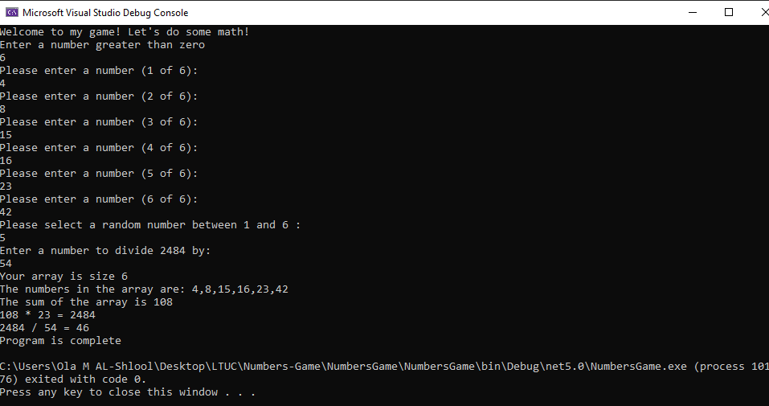

# Lab01-Numbers-Game

#### This LAB goes over how to handle exceptions in C# within Visual Studio.

##### How do you run the program?

1) Clone repo to your device.
2) Open the solution file NumbersGame.sln in Visual Studio.
3) To run the app, go to Debug > Start Without Debugging (or press ctrl+F5).

1) Upon starting the game, you will be instructed to enter a number greater than zero. This number will determine the length of the array you create.
2) You will then be asked to enter a number to populate each element in the array.
3) The game should now prompt you to enter another number between 1 and the length of the array. The number at this index will be multiplied by the sum of all the numbers in the array.
4) Next, you will need to enter a number to divide the product generated in the previous step by.
5) The program will now display your results, concluding the game.

